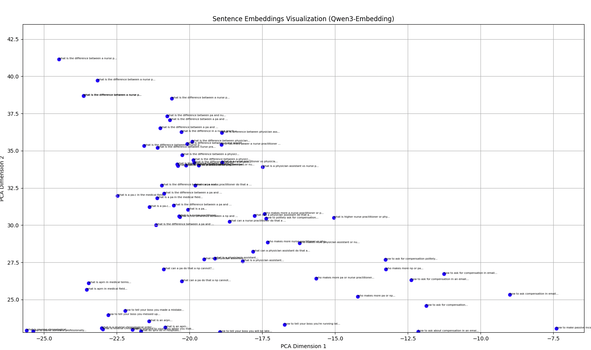

# career-questions-rag
extracting semantic meaning from career content

Embed SEO questions into vector space, reduce dimensions via PCA for visualization, and explore question similarity using cosine distance

